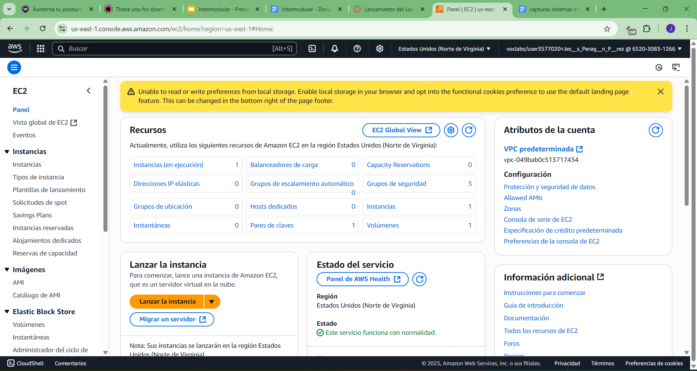
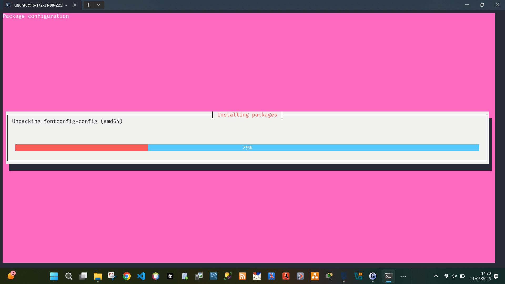
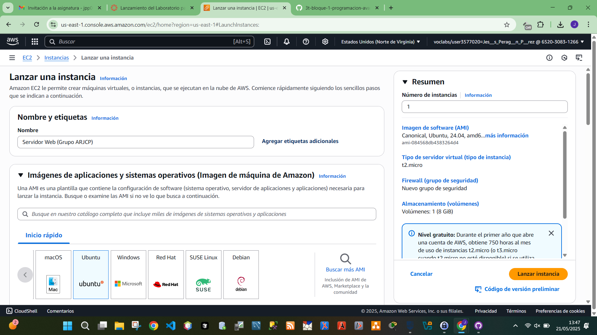
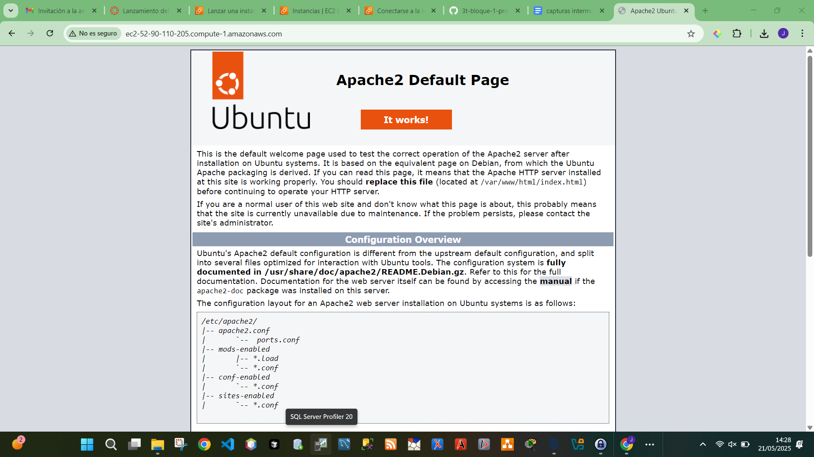

# Despliegue del sitio web en AWS (EC2)

## Requisitos
- Crear una máquina virtual en AWS EC2 (Ubuntu o Windows)
- Instalar un servidor web (Apache o Nginx)
- Copiar los archivos del sitio al servidor (vía SCP/SFTP)
- Configurar el servidor web para acceso público
- Comprobar el acceso desde navegador mediante URL pública

---

## 1. Creación de la instancia en AWS

Se ha creado una instancia EC2 con las siguientes características:

- **Sistema operativo**: Ubuntu Server 22.04 LTS (64-bit)
- **Tipo de instancia**: t2.micro (gratuita)
- **Par de claves**: `vockey.pem` para acceso SSH
- **Grupo de seguridad**: Puertos 22 (SSH) y 80 (HTTP) abiertos

  

---

## 2. Instalación del servidor Apache

Una vez conectados por SSH a la instancia con:

ssh -i vockey.pem ubuntu@ec2-3-83-219-220.compute-1.amazonaws.com

Se actualiza el sistema e instala Apache2:
sudo apt update
sudo apt install apache2 -y

Se habilita el servicio para que inicie automáticamente:

sudo systemctl enable apache2
sudo systemctl start apache2

## 3. Transferencia de archivos del sitio web
Desde tu ordenador local, usa SCP para subir tus archivos HTML, CSS y JS al servidor:

bash
scp -i nombre-clave.pem -r ./index.html/* ubuntu@ec2-3-83-219-220.compute-1.amazonaws.com:/tmp
Después, en el servidor:

sudo cp -r /tmp/* /var/www/html/
sudo chmod -R 755 /var/www/html/

## 4. Verificación del sitio desde el navegador
Abrimos un navegador y accedemos a la IP pública de la instancia EC2:

cpp
http://<3.83.219.220>

5. Resultado
El sitio web se encuentra desplegado correctamente en la nube y accesible desde cualquier navegador mediante la dirección IP pública.

